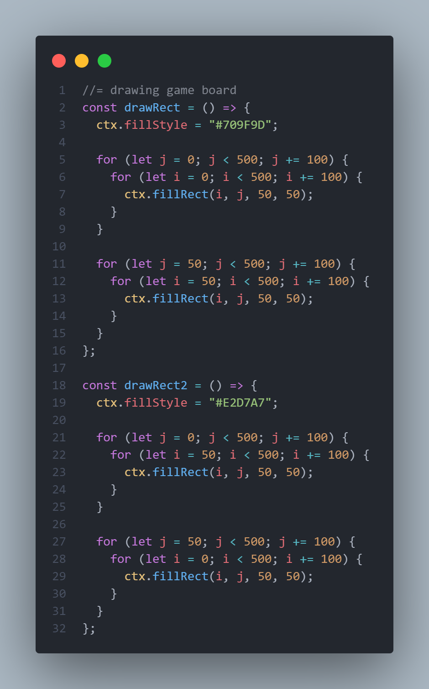

# A Snake and Ladder Game

## Project Brief

### MVP - Minimum Viable Product

- Built with HTML, CSS and JavaScript (with jQuery)
- Use Javascript for DOM manipulation
- Hosted on Github
- Displayed in the browser
- README.md file with explanations of code

### Timeframe

1 month

### Technologies & Tools Used

- HTML
- CSS
- JavaScript
- Git & GitHub

## Game Description

A **_board game_** in which **_2 players_** take turns to **_throw a dice_** to **_move counters_** along a series of squares. A **_ladder_** provides a short cut to a square nearer the finish and a **_snake_** moves a player to a square further from the **_finish_**.

## Development Milestones

1.  Start and End Page
2.  Draw Game Board
    - Draw Squares
    - Draw Numbers (index moves in alternate directions at every row)
    - Draw Snakes
    - Draw Ladders
    - Draw Players
3.  Generate Random Number
4.  Game mechanics
    - Player Mechanics
    - Snakes and Ladder Mechanics
5.  Players take turns

## Development Code Explained

### Drawing Squares

### Drawing Numbers

### Drawing Snakes & Ladders

### Drawing Players

### Generating random numbers

### Player Mechanics

### Snake and Ladder Mechanics

### Players takes turns
