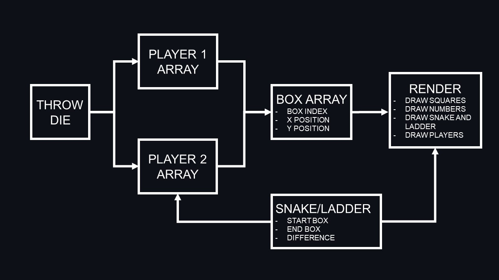

# A Snake and Ladder Game

[Go to project!](https://snake-ladder-sigma.vercel.app/)
# 

## Project Brief

### MVP - Minimum Viable Product

- Built with HTML, CSS and JavaScript (with jQuery)
- Use Javascript for DOM manipulation
- Hosted on Github
- Displayed in the browser
- README.md file with explanations of code

### Timeframe

1 month

### Technologies & Tools Used

- HTML
- CSS
- JavaScript
- Git & GitHub

## Game Description

A **_board game_** in which **_2 players_** take turns to **_throw a dice_** to **_move counters_** along a series of squares. A **_ladder_** provides a short cut to a square nearer the finish and a **_snake_** moves a player to a square further from the **_finish_**.

## Development Milestones

1.  Start and End Page
2.  Draw Game Board
    - Draw Squares
    - Draw Numbers (index moves in alternate directions at every row)
    - Draw Snakes
    - Draw Ladders
    - Draw Players
3.  Determine number of moves per turn
4.  Game mechanics
    - Player position
    - Player Win condition
    - Snakes and Ladder Mechanics
5.  Players take turns

## Development Explained

### Showing Pages

Setting on-click events to toggle from

- start page to game board
- game board to end page
- end page to start page

### Game Mechanics

### Determine number of moves per turn

Generate a random number from 1 to 6

### Drawing Squares

Each square is 50 X 50 px. There will be 10 X 10 squares to form checkered board with 100 squares.

### Players takes turns

Introducing a counter that counts the button clicks, alternating the players each click.

## Future Development

### Animate Player moves

### Add Rolling Die Graphic
